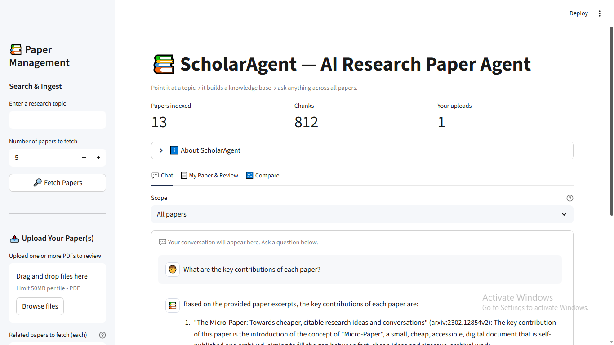
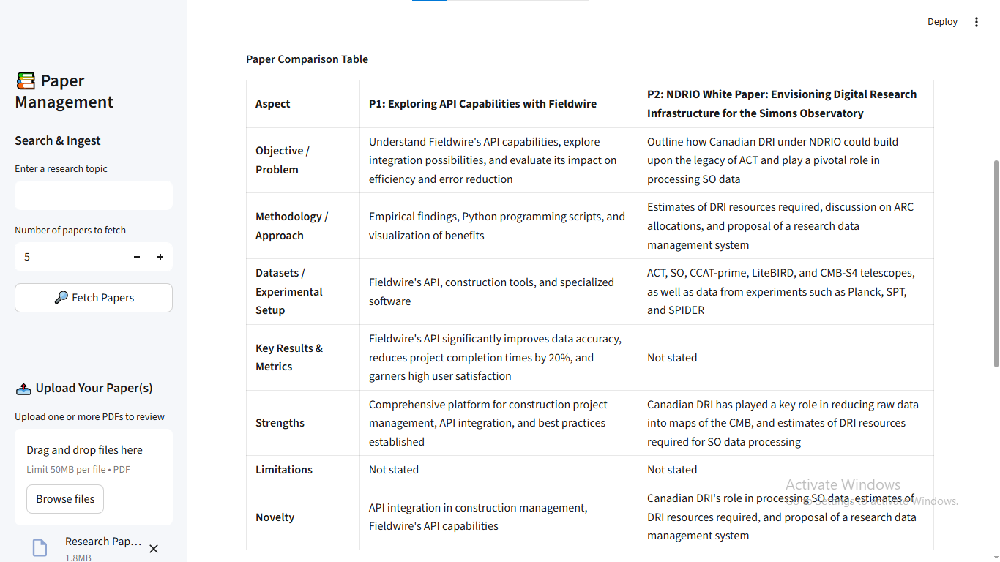
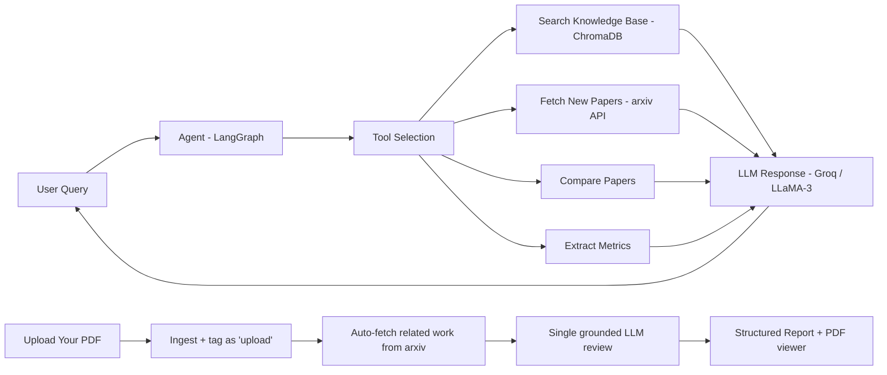

# 📚 ScholarAgent — AI Research Paper Agent

> Point it at a topic → it builds a knowledge base → ask anything across all papers.
> Or upload your own paper and get a grounded improvement review.

🔗 **[Live Demo](https://scholar-agent-ai-research.streamlit.app/)** | 📖 [How it works](#architecture)


ScholarAgent is an AI-powered research assistant that autonomously fetches academic papers from arxiv, ingests them into a vector store, and lets you have intelligent conversations across the entire corpus. It goes beyond basic RAG with an **agentic layer** — a LangGraph ReAct agent that decides when to fetch more papers, compare methodologies, and extract metrics. You can also **upload your own paper** and get a structured, grounded review against related work.

---

## 📸 Screenshots

**Chat — agentic Q&A across your papers**



**My Paper & Review — upload a PDF, get a grounded review**


**Compare — side-by-side comparison + metrics matrix**



---

## ✨ Features

- 🔍 **Autonomous paper discovery** from arxiv
- 🧠 **RAG-powered Q&A** across multiple papers
- 🎯 **Cross-encoder reranking** of retrieved chunks for higher precision
- ⚡ **Streaming responses** — direct (single-call) answers stream token-by-token
- 🤖 **Agentic reasoning** — autonomously fetches more papers when needed
- 📊 **Cross-paper comparison** and metric extraction
- 📤 **Upload your own paper(s)** → one-click **Analyze** → structured review (summary, strengths, gaps, missing related work, methodology notes, concrete improvement suggestions)
- 🔀 **Compare tab** — choose any papers (uploaded or fetched) for a side-by-side comparison across fixed aspects
- 🪞 **Paper-aware chat** — the agent knows which paper is *your* upload, so you can ask *"how does my paper compare to the others?"*
- 🎯 **Per-paper scope filter** — restrict chat answers to a single paper
- 💡 **Suggested-question chips** to guide you when you start
- 📊 **Auto-extracted metrics table** (accuracy, F1, %, …) on the Compare tab
- 📎 **Inline citations** with section labels and source excerpts
- ⬇️ **Export reviews** as Markdown or PDF
- 📄 **In-app PDF viewer** for uploaded papers (inline + open full-page + download)
- 💬 **Chat-window UI** with source citations and a tool-usage trace
- 🗄️ **Persistent knowledge base** with ChromaDB
- 🛡️ **Rate limiting / abuse protection** tuned to the Groq free tier (per-session, global, and daily caps)

---

## Architecture



The agent always searches the existing knowledge base first; retrieved chunks
are **reranked by a cross-encoder** before being passed to the LLM. If the
knowledge base lacks information, the agent fetches new papers from arxiv,
indexes them, and searches again — all autonomously — before answering with
cited sources. Uploaded papers join the same knowledge base (tagged as your
upload) so the agent can reference and compare them.

Direct, single-call answers (a query scoped to one paper, or the agent's RAG
fallback) **stream token-by-token**. The multi-step agent itself runs
non-streamed — streaming an LLM tool-call makes some Groq models emit a
malformed function format, so tool-calling stays non-streamed for reliability.

---

## 🛠️ Tech Stack

| Component | Technology |
|-----------|-----------|
| Language | Python 3.10+ |
| LLM | Groq API (`llama-3.3-70b-versatile`) |
| Embeddings | HuggingFace sentence-transformers (`all-MiniLM-L6-v2`, local) |
| Vector Store | ChromaDB (persistent) |
| Agent Framework | LangChain + LangGraph |
| Paper Source | arxiv API |
| PDF Parsing | PyMuPDF |
| Frontend | Streamlit |

---

## 🚀 Setup

```bash
# 1. Clone the repository
git clone https://github.com/your-username/ScholarAgent.git
cd ScholarAgent

# 2. Create and activate a virtual environment
python -m venv .venv
# Windows
.venv\Scripts\activate
# macOS / Linux
source .venv/bin/activate

# 3. Install dependencies
pip install -r requirements.txt

# 4. Add your Groq API key
cp .env.example .env
# then edit .env and set GROQ_API_KEY=gsk_your_actual_key_here

# 5. Run the app
streamlit run app.py
```

Get a free Groq API key at [console.groq.com](https://console.groq.com).

> **Note:** the in-app PDF viewer relies on Streamlit static file serving, which
> is enabled in `.streamlit/config.toml` (`enableStaticServing = true`). If you
> change that setting, restart the server (it is not hot-reloaded).

### 🧪 Tests & linting

```bash
pip install -r requirements-dev.txt
ruff check .
pytest
```

CI runs both on every push via [GitHub Actions](.github/workflows/ci.yml).

### 🐳 Docker

```bash
docker build -t scholaragent .
docker run -p 8501:8501 -e GROQ_API_KEY=gsk_your_actual_key_here scholaragent
```

Then open http://localhost:8501.

---

## 💡 Usage

The app has three tabs (**💬 Chat**, **📄 My Paper & Review**, **🔀 Compare**).

**💬 Chat**
1. In the sidebar, enter a topic (e.g. *"attention mechanisms in transformers"*) and click **🔎 Fetch Papers**.
2. Ask questions in the chat window (or click a **suggested-question chip**):
   - "What is the key contribution of each paper?"
   - "Compare the approaches across papers."
   - "What accuracy scores are reported?"
   - "Find me more papers on efficient transformers." *(triggers the agent to fetch new papers)*
3. Use the **Scope** dropdown to restrict answers to a single paper. Each answer has an expander showing the tools used and **inline citations** (paper, section, and an excerpt).

**📄 My Paper & Review**
1. In the sidebar's **📤 Upload Your Paper(s)** section, upload one or more PDFs, choose how many related papers to fetch, and click **🔬 Analyze My Paper(s)**.
2. The tab shows your PDF alongside a structured review (suggestions highlighted) and **Markdown/PDF export** buttons. Use the selector to switch between uploaded papers.
3. Back in **💬 Chat**, the agent knows it's *your* paper — ask *"summarise my contribution"* or *"how does my paper compare to the others?"*

**🔀 Compare**
1. Pick **two or more papers** (uploaded or fetched) and click **Compare selected papers**.
2. ScholarAgent produces a side-by-side table across fixed aspects — *objective, methodology, datasets, key results & metrics, strengths, limitations, novelty* — plus a short verdict.
3. An **auto-extracted metrics table** for the selected papers appears below the comparison.

---

## 📁 Project Structure

```
ScholarAgent/
├── .streamlit/
│   └── config.toml            # theme + static serving config
├── app.py                     # Streamlit frontend (main entry point)
├── requirements.txt
├── packages.txt               # system deps for Streamlit Cloud
├── .env.example
├── .gitignore
├── README.md
├── config.py                  # central configuration
├── core/
│   ├── paper_fetcher.py       # arxiv search & PDF download
│   ├── pdf_parser.py          # PDF extraction + academic-aware chunking
│   ├── vector_store.py        # ChromaDB wrapper
│   ├── rag_chain.py           # RAG retrieval + answer generation
│   ├── agent.py               # LangGraph agent with tools (+ streaming)
│   ├── reranker.py            # cross-encoder reranking of retrieved chunks
│   ├── uploader.py            # ingest user-uploaded PDFs
│   ├── reviewer.py            # fetch related work + structured review + metrics
│   └── exporter.py            # export reviews to Markdown / PDF
├── tools/
│   ├── search_tool.py         # search the knowledge base
│   ├── compare_tool.py        # compare papers
│   ├── extract_tool.py        # extract metrics
│   └── qa_tool.py             # fetch new papers from arxiv
├── utils/
│   └── helpers.py             # logging, text cleaning, rate limiting
├── tests/                     # pytest suite
├── Dockerfile                 # containerised deployment
├── .github/workflows/ci.yml   # lint + tests on push
├── docs/superpowers/specs/    # design docs
├── data/papers/               # downloaded PDFs (gitignored)
├── static/                    # uploaded PDFs served for viewing (gitignored)
└── chroma_db/                 # persistent vector store (gitignored)
```

---

## 🌐 Deploy to Streamlit Cloud (Free)

1. Push the project to a **public** GitHub repository.
2. Go to [share.streamlit.io](https://share.streamlit.io) and sign in with GitHub.
3. Click **"New app"** and select:
   - Repository: `your-username/ScholarAgent`
   - Branch: `main`
   - Main file path: `app.py`
4. Go to **"Advanced settings" → "Secrets"** and add:
   ```toml
   GROQ_API_KEY = "gsk_your_actual_key_here"
   ```
5. Click **Deploy** → your app will be live at `https://scholaragent.streamlit.app`.

> The knowledge base starts empty on each deployment (Streamlit Cloud storage is
> ephemeral). Fetch papers — or upload your own — through the sidebar to build it.

---

## 🛡️ Notes on Usage Limits

ScholarAgent runs on the Groq free tier (`llama-3.3-70b-versatile`: 30 req/min,
12K tokens/min, 100K tokens/day). Because the agent makes multiple LLM calls per
question, the app enforces per-session, global, and daily rate limits to stay
within those bounds and prevent abuse on public deployments. Tune them in
`config.py`. Never commit your `.env` — it is gitignored.

---

## 📄 License

MIT
